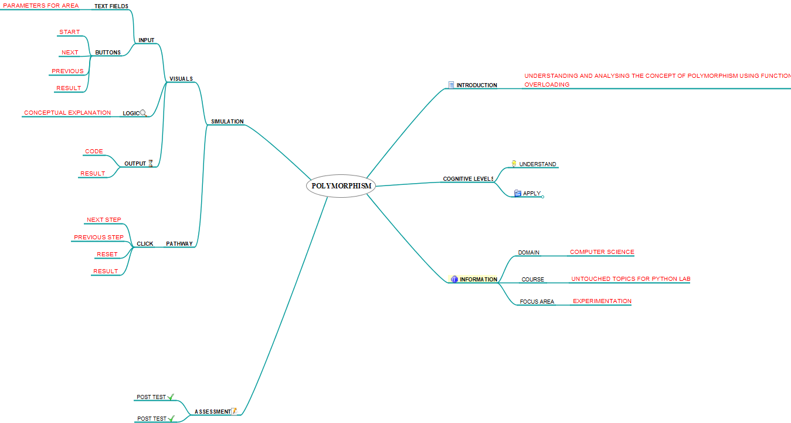

## Storyboard (Round 2)

Experiment 1: Write a program in python to calculate the area of circle, rectangle and triangle using polymorphism.

### 1. Story Outline:

The experiment is based on the concept of polymorphism, implemented through python. Student approaches the simulator in order to understand the concept of polymorphism. Polymorphism means the ability to take various forms. In this experiment, a function called 'getArea()' is being overloaded with the help of different signatures i.e. different number of parameters for the shapes such as Triangle, Rectangle, and Circle. Student interacts with the simulator by providing some parameter values of a shape which can be a radius of a circle or length of sides of a shape in order to compute the area of corresponding shape. Simulator will provide not only the area of corresponding shape but also helps the student to understand the concept of polymorphism by providing the logical explanation of the output  i.e. how the area is being calculated.

### 2. Story:

Polymorphism is derived from two Greek words: poly and morphs. The word "poly" means many and "morphs" means forms. So, polymorphism means many forms. Polymorphism is a concept by which we can perform a single action in different ways. An operation may exhibit different behavior in different class. The behavior depends on the type of data. We can perform polymorphism in python by method overloading and method overriding. Here, we will focus on method overloading. Method overloading in Python is a feature that allows to have multiple method with same name but different signature. Overloading is the ability of a method to behave in different ways based on the parameters that are passed to the method. 
Advantage of method overloading are : 
•	Overloading a method fosters reusability. For example, instead of writing multiple methods that differ only slightly, we can write one method and overload it. 
•	Overloading also improves code clarity and eliminates complexity. 
In Python, we can create a method that can be called in different ways. So, we can have a method that has zero, one or more number of parameters. Depending on the method definition, we can call it with zero, one or more arguments. Given a single method or function, the number of parameters can be specified. Whenever the overloaded function is called the control matches the signature of called method with overloaded method. And executes the definition of the method whose signature is matched. This process of calling the same method in different ways is called method overloading.

#### 2.1 Set the Visual Stage Description:
We divide  our whole simulator page into three pane. On the top of first pane text box will appear in which user has to provide some parameter values of a shape which can be a radius of a circle or length of sides of a shape in order to compute the area of corresponding shape. This text box is immediately followed by start button then followed by previous, next and reset buttons. 
In the second pane user observes the code snippet on the basis of number of parameters given by the user. This pane also helps the student to understand the concept of polymorphism by providing the logical explanation of the output i.e. how the area is being calculated. 
When the logical explanation will be completed the area of the corresponding shape will be displayed in the last pane i.e third pane.

#### 2.2 Set User Objectives & Goals:
1.	The prime objective of the experiment is to demonstrate Polymorphism in python and how it allows us to perform a single action in different ways. 
2.	The simulator allows the user to input the desired dimensions and based on the input it performs single action (calculation of Area) using different ways. 
3.	To explain how method overloading works and how signatures are used to differentiate between two function calls in the run time. 
4.	To observe the output (Area) shown by the simulator when the user passes different no of inputs. 
5.	To answer the assessment questions based on the observations. 

#### 2.3 Set the Pathway Activities:

1)	User has to provide the parameter values of a shape (can be a radius of a circle or length of sides of a shape) in the text box provided in the first pane of the simulator. 
2)	Click on the “Start” button. It takes you to second pane in which whole code snippet is displayed.  
3)	 Click on “next “button. It displays code snippet after matching the signature of called method with overloaded method. 
4)	Click on “next “button. It provides the logical explanation of the output i.e. how the area is being calculated. 
5)	Click on “Next” button. The area of the corresponding shape is displayed as output in the third pane, with the end of logical explanation.   
6)	At any step user can use “Previous” button in order to see the previous logic again. 
7)	User can use “Reset” button to calculate the area of another shape. 

##### 2.4 Set Challenges and Questions/Complexity/Variations in Questions:

Difficulty Level : Recall 
Q. For Overloading a method in python requires : 
<b>A. Different number of arguments</b> 
B. Different return types 
C. Both 
D. None of the above 

Difficulty Level : Understand 
Q. Can we overload a method with same number of arguments in python? 
A. YES 
<b>B. NO </b> 

Difficulty Level : Apply 
Q. How can we get the area of a square? 
A. By passing one argument 
<b>B. By passing two same argument</b> 
C. Cannot be calculated 
D. None of the above 

Difficulty Level : Analyze 
Q. Assume a method getArea() is overloaded, having 0, 1 and 2 parameters respectively. Which of the definition of overloaded method is more likely to be executed if overloaded method is called in such a way : getArea(0) ? 
A. def getArea(var1,var2): 
<b>B. def getArea(var1):</b> 
C. def getArea(): 
D. First declared definition of overloaded method 
E. None of the above 

Q. What will happen if signature of called method doesn't match with any overloaded method? 
A. Execution of definition with most similar signature 
B. No Output 
<b>C. Error</b> 
D. None of the above 

##### 2.5 Allow pitfalls:
1. The pitfalls are designed to clear the misconceptions or incorrect knowledge about the concept of Polymorphism and method overloading in python. 
2. The simulator will be able to clear the misconception about the working of method overloading. 
3. Student may expect different outputs on the different data-type inputs (for eg 5 & 5.0). The simulator will be able to remove this misconception. 

##### 2.6 Conclusion:
1. Assessment/evaluation of the pre-test and post-test should be given immediately to the user. The moment the student clicks on the answer of his choice, the CORRECT ANSWER should be displayed below the question. This would enable the student to understand whether he is right or wrong.
2. This would prompt the users as to how many answers were correctly answered.
3. Marks maybe assigned to each question which would enable the student to calculate his performance.

##### 2.7 Equations/formulas: 

 

 

 

### 3. Flowchart 
 
 

### 4. Mindmap:

  

### 5. Storyboard :
Storyboard: <a href="storyboard/storyboard.gif"> [here]</a>

