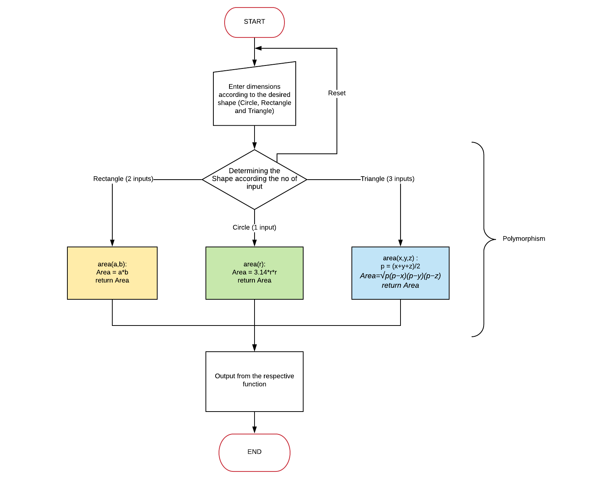

## Storyboard (Round 2)

Delete this line before submission : The core principle of Round 2 is to make the lab/experiment documentation elaborated in a manner that it makes easy for any person (developer/domain and non domain faculty/student) to understand and develop the lab/experiment.

Experiment 1: Write a program in python to calculate the area of circle, square and triangle using polymorphism.

### 1. Story Outline:

The experiment is based on the concept of polymorphism, implemented through python. Student approaches the simulator in order to understand the concept of polymorphism. Polymorphism means the ability to take various forms. In this experiment, a function called 'getArea()' is being overloaded with the help of different signatures i.e. different number of parameters for the shapes such as Triangle, Rectangle, and Circle. Student interacts with the simulator by providing some parameter values of a shape which can be a radius of a circle or length of sides of a shape in order to compute the area of corresponding shape. Simulator will provide not only the area of corresponding shape but also helps the student to understand the concept of polymorphism by providing the logical explanation of the output  i.e. how the area is being calculated.

### 2. Story:

Polymorphism is one of the core concepts in OOP languages. This experiment uses python programming language. Polymorphism means the ability to take more than one form. Polymorphism can be achieved either by method overloading or by method overriding. This experiment comprises of polymorphism by method overloading. 
In method overloading, a method can be overloaded i.e. one function with same name can have more than one definition which is achieved with the help of different signature. Here signature means the number of parameters, data-type of parameters and order of parameters. Method overloading increases the readability of the program.
Whenever the overloaded function is called the control matches the signature of called method with overloaded method. And executes the definition of the method whose signature is matched.

#### 2.1 Set the Visual Stage Description:
Describe here : (guide When a user lands up into a simulator, the visual stage is the first thing that user comes across. The visual stage should include all the elements to be seen by a user on an imaginary canvas.  (This should NOT include any drawings. ) )

#### 2.2 Set User Objectives & Goals:
1. The prime objective of the experiment is to demonstrate Polymorphism in python.  
2. To explain the working of method overloading.  
3. To calculate the area of different shapes using method overloading.  

#### 2.3 Set the Pathway Activities:

Describe the pathway activites here : (Guide : Set the pathway activities in line with the learning objectives (LOs)  & with a view to achieve the goals set in round #0 & round#1.  (once he begins, how he will traverse through the entire experiment ? in descriptive))

##### 2.4 Set Challenges and Questions/Complexity/Variations in Questions:

Describe the challenges Here : (guide : Set Challenges and Questions/Complexity/variations in questions according to User’s level, so as to invoke the learners’ interest.  (while traversing, what challenges he will face? how he has to solve and overcome ? descriptive).)

##### 2.5 Allow pitfalls:
Describe the pitfalls here: (guide : (while traversing or while solving challenge, how will we bring a situation in front of him that he commits mistake if he is not attentive , or not following procedure , descriptive))

##### 2.6 Conclusion:
Describe conclusion here : (guide: This may include displaying: how much time did the user take to solve the questions/ How many questions were right?/ How many hints did the learner use. Based on this the evaluation/marking to be suggested to the user. (once he is towards the completion of the experiment, what LO he is taking along with him, what will be his probable, interpretation/conclusion , descriptive) )

##### 2.7 Equations/formulas: NA

 

 

 

### 3. Flowchart 4
 
 

### 4. Mindmap:

  

### 5. Storyboard :
Storyboard: <a href="Storyboard/carwiper.gif"> [here]</a>
Link to storybaord (.gif file ) here :
(guide: This document should include sketching and description scene wise (duration, action, description). Software to be used for storyboarding : https://wonderunit.com/storyboarder/ (Its a FOSS tool) . tutorial on how to use it https://www.youtube.com/watch?v=LAeCEpG0KX4
